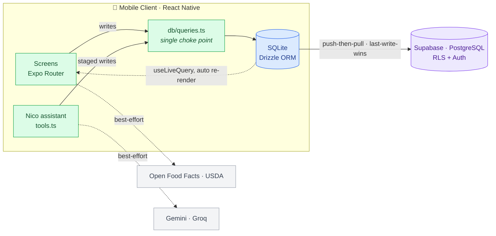
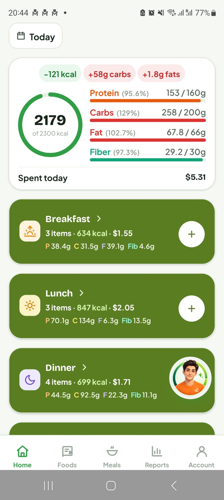
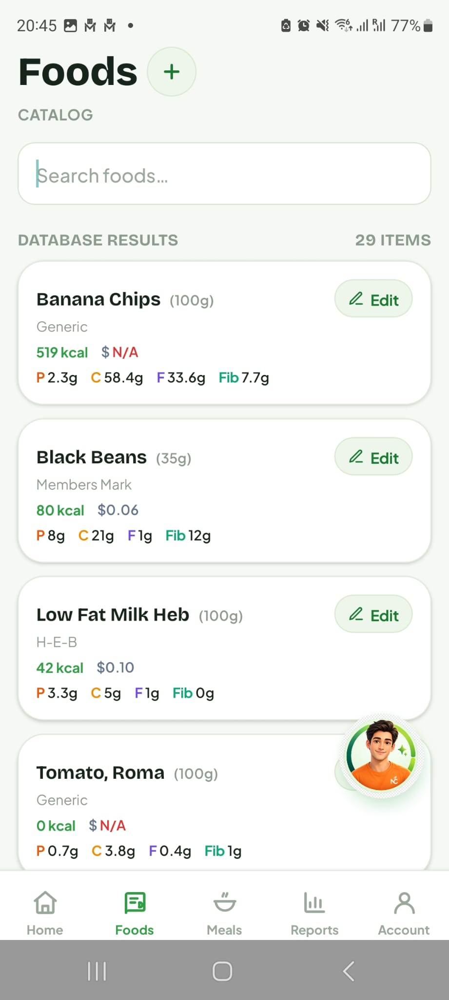
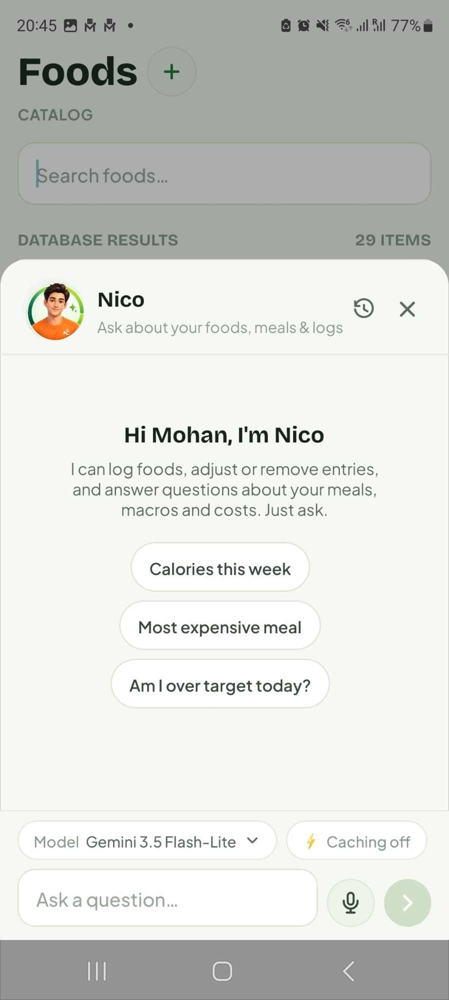

<!-- ================== HEADER ================== -->
<h1 align="center">NutriCraft</h1>
<h3 align="center"><em>An offline-first React Native food, macro &amp; <strong>cost</strong> tracker with cross-device cloud sync and an AI logging assistant.</em></h3>

<!-- Tech Stack with Devicons + labels -->
<table align="center">
  <tr>
    <td align="center" width="65">
      <br>
      <sub><b>React&nbsp;Native</b></sub>
    </td>
    <td align="center" width="65">
      <br>
      <sub><b>TypeScript</b></sub>
    </td>
    <td align="center" width="65">
      <br>
      <sub><b>SQLite</b></sub>
    </td>
    <td align="center" width="65">
      <br>
      <sub><b>Supabase</b></sub>
    </td>
    <td align="center" width="65">
      <br>
      <sub><b>NativeWind</b></sub>
    </td>
  </tr>
</table>

<p align="center">
  <!-- Status Badges: unified soft-orange theme -->
  
  
  
</p>
<p align="center">
  
  
  
  
</p>


<h2 id="live-demo">🎬 Project Demo</h2>

<p align="center">
  <video
    src="https://raw.githubusercontent.com/mohansaiganesh/NutriCraft/main/assets/demo.mp4"
    poster="https://raw.githubusercontent.com/mohansaiganesh/NutriCraft/main/assets/poster.png"
    controls
    width="270"
    height="600">
    Your browser can't play embedded video.
    <a href="https://www.youtube.com/watch?v=CsK3mctQVyk">Watch the demo on YouTube</a>.
  </video>
</p>
<p align="center">▶️ Video not loading? <a href="https://www.youtube.com/watch?v=CsK3mctQVyk">Watch it on YouTube</a>.</p>


## 📖 Table of Contents
1. [About the Project](#about-the-project)  
2. [Tech Stack](#tech-stack)  
3. [Features](#features)  
4. [Architecture](#architecture)  
5. [Getting Started](#getting-started)  
6. [Project Structure](#project-structure)  
7. [Screenshots / Demo](#screenshots-demo)  
8. [Usage](#usage)  
9. [Challenges & Learnings](#challenges-learnings)  
10. [Future Enhancements](#future-enhancements)  
11. [Contributing](#contributing)  
12. [License](#license)  
13. [Contact](#contact)


<h2 id="about-the-project">1. 🌟 About the Project</h2>

**NutriCraft** is a local-first personal food, macro **and cost** tracker for mobile. Most
calorie apps ignore money and force you online. NutriCraft tracks calories, macros, and your
grocery spend, and it works instantly offline (on the subway, with no signal), then syncs to the
cloud across every device you sign in on.

The whole app is a four-step loop:

> **Catalog** foods once, per-100&nbsp;g/ml (calories, macros, fiber, sodium, **and price**) →
> **Compose** reusable meals by gram weight → **Log** what you actually ate each day →
> **Review** daily and range totals (macros *and* cost) against your targets, with printable reports.

I built it as a production-grade portfolio project: local SQLite for instant offline reads, a
hand-built delta-sync engine to Supabase Postgres, proper multi-user data isolation, and **Nico**,
a provider-neutral AI assistant that logs food by chat or voice behind a confirmation card. The
schema and sync were designed from the start to migrate to hosted Postgres with no data-model rewrite.


<h2 id="tech-stack">2. 🛠 Tech Stack</h2>

<p>
  <!-- Frontend / UI -->
  
  
  
  
  
  
  
  <br>
  <!-- Local data -->
  
  
  <!-- Backend / sync -->
  
  
  <br>
  <!-- AI & external data -->
  
  
  
  
  <!-- Testing -->
  
</p>


| Layer                  | Technologies                                                                                                                       |
| ---------------------- | --------------------------------------------------------------------------------------------------------------------------------- |
| **Frontend / UI**      | React Native + Expo (SDK 54, RN 0.81, React 19), Expo Router (file-based), TypeScript, NativeWind (Tailwind), Reanimated 4, Zustand |
| **Local data**         | SQLite (`expo-sqlite`) + Drizzle ORM, reactive `useLiveQuery`                                                                      |
| **Backend / sync**     | Supabase: PostgreSQL, Row-Level Security, Auth; push-then-pull last-write-wins delta sync                                          |
| **AI & external data** | Google Gemini · Groq (provider-neutral, tool-calling); Open Food Facts · USDA FoodData Central                                     |
| **Testing**            | Jest + jest-expo (RN-free pure-core modules)                                                                                       |


> **Why this stack:** Expo/RN + TypeScript on the front, Drizzle-over-SQLite locally, syncing to
> Supabase Postgres. I chose it so the local and cloud schemas are literally the *same shape*, which
> is what makes the sync engine a field-mapping problem instead of a translation problem.


<h2 id="features">3. ✨ Features</h2>

- ✅ **Per-100 food catalog with cost:** store calories, macros, fiber, sodium *and price* once, and amounts are computed live from grams.
- ✅ **Reusable meals by gram weight:** a meal is just a list of `food + grams`.
- ✅ **Daily logging by meal type:** record what you actually ate, per day.
- ✅ **Macro *and cost* review:** daily and range totals vs targets, with printable HTML reports.
- ✅ **Offline-first and instant:** local SQLite is the source of truth, so the cloud is never on the render path.
- ✅ **Cross-device cloud sync:** push-then-pull, last-write-wins delta sync to Supabase Postgres, and your data survives uninstall/reinstall.
- ✅ **Multi-user isolation:** Row-Level Security per account, plus a shared admin-curated global food catalog everyone reads.
- ✅ **Online food search:** Open Food Facts + USDA FoodData Central, merged, deduped and best-effort, so a down source never blocks local search.
- ✅ **Nico, the AI assistant:** logs food and applies saved meals by chat *or voice*, behind a single confirmation card, and works with more than one provider (Gemini or Groq).
- ✅ **AI observability:** every assistant run is traced (tokens incl. cached, latency, per-step tool I/O) into a syncable `assistant_traces` table.
- ✅ **Reactive UI:** screens re-render automatically on any write via SQLite's change listener, with no manual refresh code.


<h2 id="architecture">4. 🏗 Architecture</h2>

NutriCraft is **client-first**: the mobile app is the system, and the cloud is a sync *target*, not
a render dependency. Three rules hold it together:

1. **Screens never touch the DB.** Every read/write routes through `db/queries.ts` (even the AI's write tools), so the soft-delete, `updatedAt` and `user_id` invariants live in one file.
2. **Local SQLite is the UI's source of truth.** The cloud is never on the render path, which is why the app is instant and works offline.
3. **The schema is designed once, for Postgres.** Local and cloud are the same shape, so sync is field-mapping, not translation.

<!-- GitHub renders Mermaid natively. -->



**Sync engine:** per table, a cursor holds the max `updated_at` synced so far. **Push**
local rows newer than the cursor, **pull** remote rows newer than the cursor, and apply last-write-wins
(overwrite only if strictly newer). ISO-8601 UTC timestamps sort lexicographically, so device clocks
never need to agree. All decision logic (cursor math, LWW, error classification, row mapping) lives in
`lib/syncCore.ts` with zero RN/network imports, so it's unit-testable under plain Jest.


<h2 id="getting-started">5. 🚀 Getting Started</h2>

### Prerequisites

```text
Node.js >= 18
Expo Go app (to run on a device) or the Android/iOS native toolchain
A Supabase project (the app requires cloud auth/sync; see supabase/README.md)
```

Create a `.env` (see `.env.example`):

```bash
EXPO_PUBLIC_SUPABASE_URL=...      # required
EXPO_PUBLIC_SUPABASE_ANON_KEY=... # required
EXPO_PUBLIC_FDC_API_KEY=...       # optional, enables USDA online food search
```

Without the Supabase vars the app shows a "Cloud not configured" screen instead of running.

### Installation

```bash
git clone https://github.com/mohansaiganesh/NutriCraft.git
cd NutriCraft
npm install
```

### Run the App

```bash
npm start            # then press 'a' (Android), 'i' (iOS), 'w' (web), or scan the QR in Expo Go
```

First launch applies the Drizzle DB migration; a new account opens to the shared catalog and adds its own private foods.

### Scripts

| command               | what it does                                                   |
| --------------------- | ------------------------------------------------------------- |
| `npm start`           | Expo dev server (`a` Android, `i` iOS, `w` web)               |
| `npm test`            | Jest: nutrition math, food search/match, sync, reports, assistant   |
| `npm run typecheck`   | `tsc --noEmit`                                                 |
| `npm run db:generate` | Regenerate Drizzle migrations after editing `db/schema.ts`    |

### Building a release APK (Android)

This is a prebuild workflow, so the native `android/` project is generated from `app.json`.

**Prerequisites (one-time):** JDK 17 and the Android SDK (easiest via Android Studio). Set
`ANDROID_HOME` and accept the SDK licenses:

```bash
# ANDROID_HOME is typically C:\Users\<you>\AppData\Local\Android\Sdk
sdkmanager --licenses
```

**1. Generate `android/` if it's missing** (it's regenerated from `app.json`):

```bash
npx expo prebuild --platform android   # add --clean to regenerate from scratch
```

Hand edits inside `android/` are wiped by `--clean`, so treat `app.json` (and config plugins) as the
source of truth.

**2. Build the APK:**

```bash
cd android
./gradlew assembleRelease           # PowerShell: .\gradlew.bat assembleRelease
```

Output: `android/app/build/outputs/apk/release/app-release.apk`.

> **Caveat:** the default `release` build type is signed with the **debug** keystore
> (`android/app/build.gradle`). That APK is fine for testing and sideloading, but **not** for the
> Play Store (see "For distribution" below).

**Minimum-size APK for modern devices:** build only 64-bit ARM and turn on minify + resource
shrinking (both off by default):

```bash
./gradlew assembleRelease \
  -PreactNativeArchitectures=arm64-v8a \
  -Pandroid.enableMinifyInReleaseBuilds=true \
  -Pandroid.enableShrinkResourcesInReleaseBuilds=true
```

- `arm64-v8a` only drops the other ABIs, which is the biggest single saving. It won't run on 32-bit
  devices or the default x86_64 emulators.
- Minify (R8) + resource shrinking can strip something a native module reflects on, so test the
  built APK and add keep rules to `android/app/proguard-rules.pro` if needed.
- To make these permanent, move the three flags into `android/gradle.properties`.

**One-liner alternative:** `npx expo run:android --variant release` (prebuild + build + install on a
connected device/emulator).

**For distribution:** generate your own release keystore and wire it into `signingConfigs` in
`android/app/build.gradle`. For the Play Store, prefer an AAB (`./gradlew bundleRelease`) so
per-device splits minimize delivered size. Bump `versionCode` in `build.gradle` for each upload, and
replace the placeholder package `com.anonymous.nutricraft`.

> The full backend setup is documented in [`supabase/README.md`](./supabase/README.md).


<h2 id="project-structure">6. 📂 Project Structure</h2>


```text
📦 nutricraft   (the repo root IS the app)
 ┣ 📂 app                      # Expo Router file-based routes
 ┃ ┣ 📂 (tabs)                 # Today / Foods / Meals / Reports / Account
 ┃ ┃ ┗ 📂 account              # profile, security, preferences, data, traces
 ┃ ┣ 📂 food · meal · log      # detail + edit screens ([id].tsx dynamic routes)
 ┃ ┗ 📜 _layout.tsx            # DB gate + auth gate
 ┣ 📂 db                       # schema.ts · queries.ts · client.ts · migrate.ts
 ┣ 📂 lib
 ┃ ┣ 📜 nutrition.ts           # pure, RN-free macro/cost math (single source of truth)
 ┃ ┣ 📜 sync.ts · syncCore.ts  # delta-sync engine (imperative shell + pure core)
 ┃ ┣ 📜 foodSearch.ts          # Open Food Facts + USDA providers
 ┃ ┗ 📂 assistant              # Nico: agent.ts, provider.ts, tools.ts, providers/
 ┣ 📂 components               # AssistantOverlay, AuthScreen, charts, ui, …
 ┣ 📂 __tests__                # 12 Jest suites over the highest-risk logic
 ┣ 📂 drizzle                  # generated SQL migrations
 ┣ 📂 supabase                 # schema.sql · rls.sql · seed-shared-catalog.sql · functions/
 ┗ 📜 README.md · AGENTS.md · package.json · app.json · tsconfig.json
```


<h2 id="screenshots-demo">7. 🖼 Screenshots</h2>

<table align="center">
  <tr>
    <td align="center"><b>Today (dashboard)</b></td>
    <td width="40"></td>
    <td align="center"><b>Foods + online search</b></td>
    <td width="40"></td>
    <td align="center"><b>Nico assistant</b></td>
  </tr>
  <tr>
    <td align="center"></td>
    <td width="40"></td>
    <td align="center"></td>
    <td width="40"></td>
    <td align="center"></td>
  </tr>
</table>


<h2 id="usage">8. ⚡ Usage</h2>

1. **Catalog:** add a food once, per-100&nbsp;g/ml (calories, macros, fiber, sodium, price). Or search Open Food Facts / USDA and save a result as your own private food.
2. **Compose:** build reusable meals as a list of `food + grams`.
3. **Log:** record what you ate on a given day, by meal type. Nico can do this for you by chat or voice, and you just confirm the card.
4. **Review:** check daily and range totals (macros *and* cost) against your targets, and export a printable report.


<h2 id="challenges-learnings">9. 🧠 Challenges & Learnings</h2>

| Challenge | Solution &amp; takeaway |
| --- | --- |
| **The sync deadlock:** a child row (e.g. a `meal_item`) pulled before its parent threw a foreign-key error, froze the cursor, and re-failed *forever*. | A **row-resilient pull** (skip the bad row, apply the rest), **FK parent backfill** (fetch the missing parent by id and retry the child once), and a **two-speed cursor** that only advances past rows that succeeded and precede the earliest failure. |
| **Pure-core / imperative-shell:** the risky logic needed fast, deterministic tests. | Kept nutrition math, sync decisions and external-API mapping in RN-free modules (`nutrition.ts`, `syncCore.ts`), importable straight into Jest with no emulator. |
| **A provider-neutral AI loop:** support multiple LLM providers without rewrites. | The agent speaks neutral conversation/tool types and reaches a model through an adapter registry, so onboarding Groq alongside Gemini was one adapter and one registry row, with no loop or UI changes. Cross-provider quirks (Gemini `thoughtSignature`s, Groq `reasoning`/prefix cache) are handled as opaque metadata I round-trip. |
| **Human-in-the-loop by design:** the AI's writes must never drift from what the model claimed. | Writes never execute inline. They *stage* (validated, ids resolved), then the whole batch surfaces as **one confirmation card** built deterministically from resolved DB data. With no confirmer wired in, everything auto-rejects. |


<h2 id="future-enhancements">10. 🚧 Future Enhancements</h2>

*(The schema is already designed to support these.)*

- 📈 Adaptive TDEE engine.
- 📷 AI photo-label + meal-photo calorie estimation.
- 🔎 Barcode scanning and USDA *branded* foods.
- 🤖 Expanded Nico write scope: creating/editing foods & meals, changing targets (needs shared-catalog ownership guards + batch confirmation), and standalone quick-log voice outside the Nico composer.


<h2 id="contributing">11. 🤝 Contributing</h2>

This is a personal portfolio project and isn't currently accepting external contributions, but
feedback and questions are welcome (see [Contact](#contact)).


<h2 id="license">12. 📝 License</h2>

Personal **portfolio project**, shared to demonstrate engineering work and **not licensed for reuse**.
No license is granted, so please don't redistribute or use the source without permission.


<h2 id="contact">13. 📬 Contact</h2>

<p align="left">
  &nbsp;&nbsp;
  <a href="https://www.linkedin.com/in/mohansaiganeshkanna/">
    
  </a>
  <a href="https://kmohansaiganesh.github.io/Portfolio">
    
  </a>
  <a href="mailto:mohansaiganeshk@gmail.com">
    
  </a>
</p>
